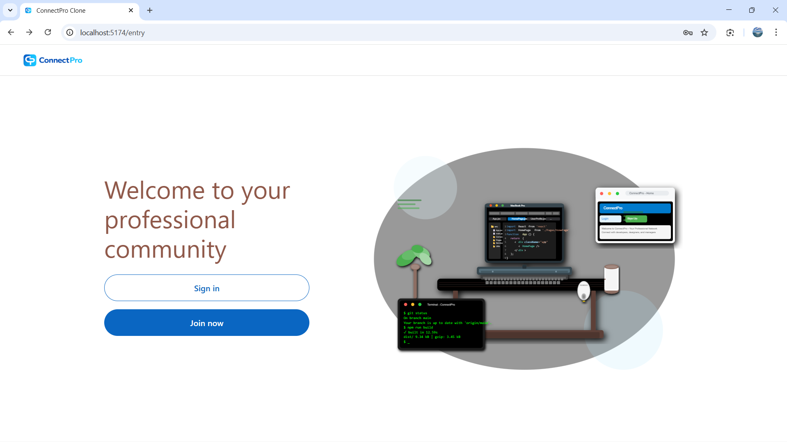
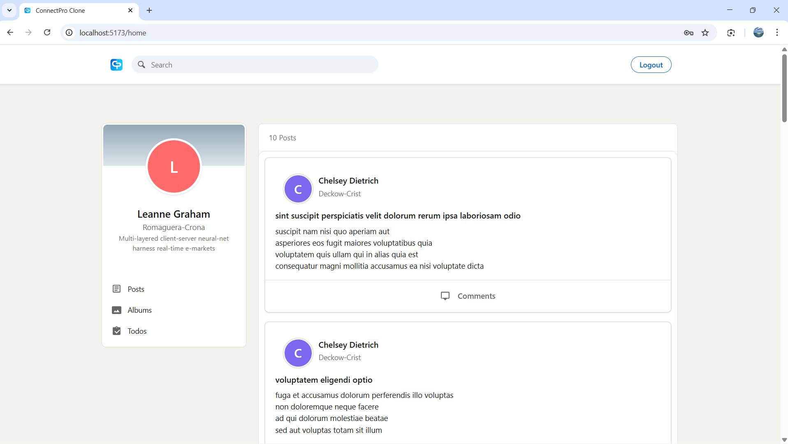
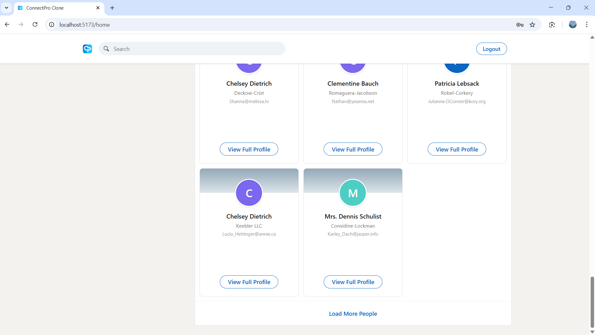
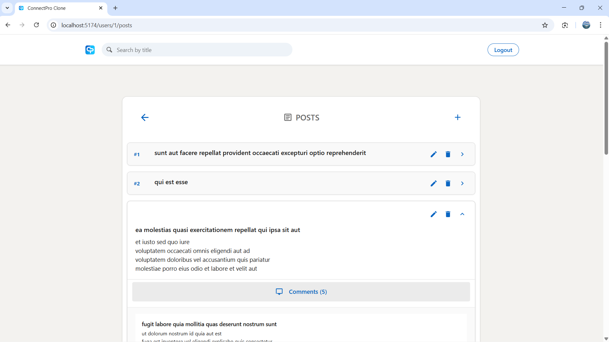
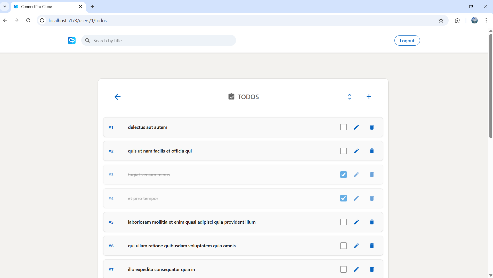

# ConnectPro - Professional Social Network


**ConnectPro** is a LinkedIn-style professional social network built with React and Vite. Connect with developers, designers, and managers in your professional community.

## 📸 Screenshots

### Entrypage


### Homepage
  


### My Posts


### Todos & Albums


---

## Features

* **Secure Authentication:** Sign up and log in safely.
* **Profile Management:** Customize professional profiles.
* **Posts & Feed:** Share updates, articles, and ideas.
* **Comments & Search:** Engage with content and search easily.
* **Photo Albums & Todos:** Manage media and tasks.
* **Responsive Design:** Works perfectly on desktop and mobile.
* **Modern UI:** Dark and elegant interface for a professional feel.

---

## Tech Stack

* **Frontend:** React 19, Vite, React Router, CSS Modules
* **Backend:** TypeCode (DB), Local Storage
* **Tools:** ESLint, Concurrently

---

## 🚀 Installation & Setup

### Prerequisites
- **Node.js** (version 16 or higher)
- **npm** or **yarn** package manager
- **Git** for version control

### Quick Start
1. **Clone the repository**
   ```bash
   git clone https://github.com/TzippiTzukrov/react_final_project.git
   cd react_final_project
   ```

2. **Install dependencies**
   ```bash
   npm install
   ```

3. **Start the development server**
   ```bash
   npm run dev
   ```

4. **Open your browser**
   
   Navigate to [http://localhost:5173/](http://localhost:5173/) to view the application.

### Available Scripts
```bash
npm run dev          # Start both frontend and backend servers
npm run dev:client   # Start only React development server
npm run dev:server   # Start only JSON Server backend
npm run build        # Create production build
npm run preview      # Preview production build
npm run lint         # Run ESLint
```

---

## 🏗️ Project Structure

```
connectpro/
├── public/                 # Static assets
│   ├── full-logo.png      # Main logo
│   └── short-logo.png     # Favicon
├── src/
│   ├── Components/        # Reusable UI components
│   │   ├── CommentForm.jsx
│   │   ├── CommentItem.jsx
│   │   ├── CommentsList.jsx
│   │   ├── PostFeed.jsx
│   │   ├── PostItem.jsx
│   │   └── UserProfile.jsx
│   ├── Context/           # React Context for global state
│   ├── Hooks/             # Custom React hooks
│   ├── Pages/             # Page components
│   │   ├── EntryPage.jsx
│   │   ├── HomePage.jsx
│   │   ├── LoginPage.jsx
│   │   └── RegisterPage.jsx
│   ├── Services/          # API services
│   ├── styles/            # CSS Modules
│   ├── Utils/             # Utility functions
│   ├── App.jsx
│   └── main.jsx
├── Server/
│   └── db.json           # Mock database
├── dist/                 # Production build (generated)
├── README.md
├── package.json
├── vite.config.js
└── eslint.config.js
```

---

## Future Improvements

* Real backend integration (Node.js + Express + database)
* Private messaging system
* Notifications and alerts
* Add links to resumes and professional portfolios

---

## License

MIT License © 2026 Tzippi Tzukrov
