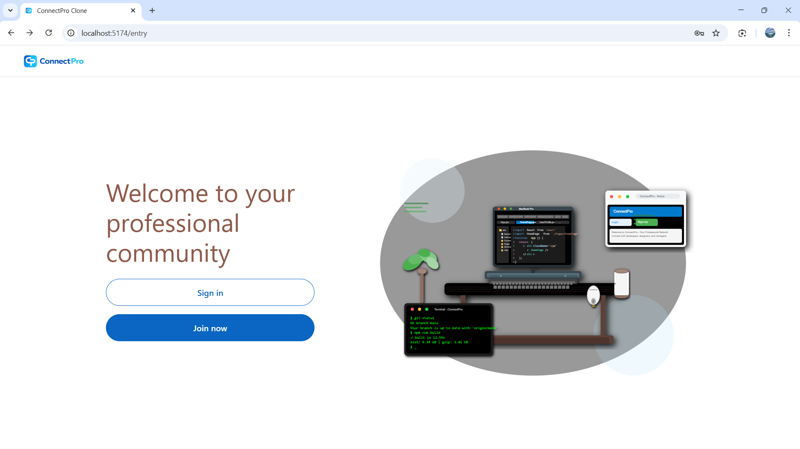
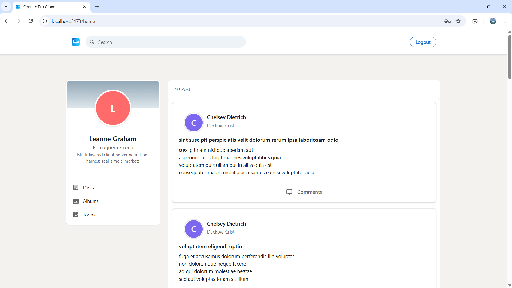
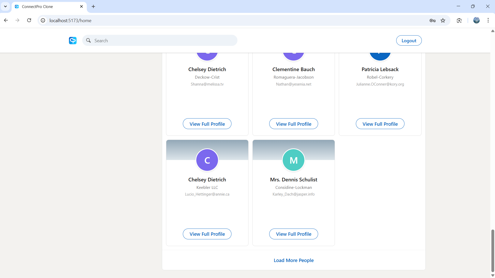
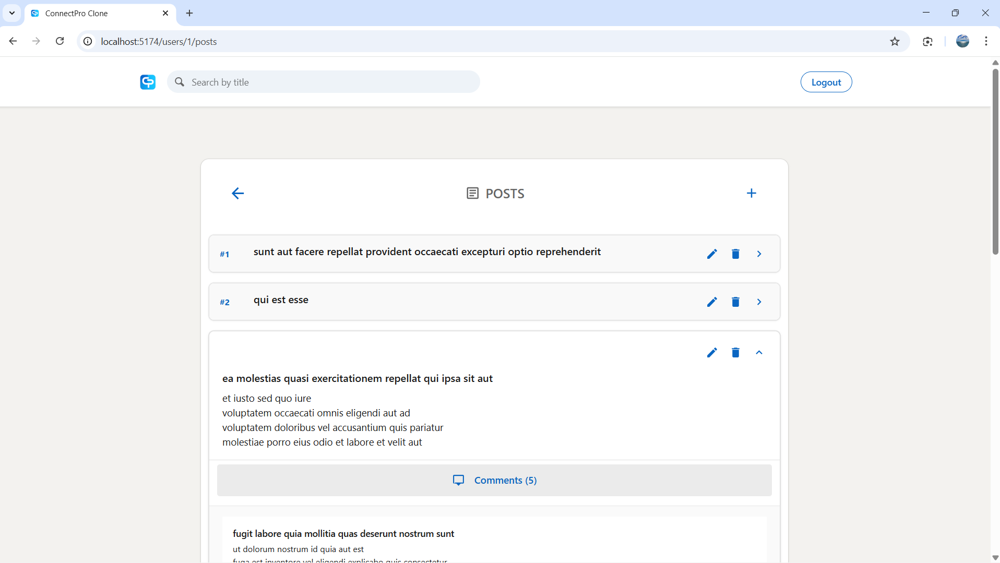

# ConnectPro - Professional Social Network

> 🔗 **Live Demo:** [Click here to view the live application](https://tzippitzukrov.github.io/react_final_project)


**ConnectPro** is a LinkedIn-style professional social network built with React and a custom Node.js + Express + MySQL backend.

---

## Screenshots

### Entry Page


### Home Page



### My Posts


### Todos & Albums


---

## Features

- **Secure Authentication:** JWT-based login and registration with bcrypt password hashing
- **Profile Management:** View and edit professional profiles
- **Posts & Feed:** Create, edit, and delete posts
- **Comments:** Add and manage comments on posts
- **Photo Albums:** Create albums and manage photos
- **Todos:** Personal task management per user
- **Protected Routes:** Ownership checks — users can only modify their own data
- **Responsive Design:** Works on desktop and mobile

---

## Tech Stack

### Frontend
- React 19, Vite, React Router DOM
- CSS Modules

### Backend
- Node.js, Express
- MySQL2 (connection pool)
- JWT (jsonwebtoken) for authentication
- bcrypt for password hashing
- dotenv, cors, nodemon

---

## Project Structure

```
connectpro-fullstack/
├── Client/                     # React frontend
│   ├── public/
│   ├── src/
│   │   ├── Auth/
│   │   ├── Common/
│   │   ├── Components/
│   │   ├── Context/
│   │   ├── Hooks/
│   │   ├── Pages/
│   │   ├── Routing/
│   │   ├── Services/
│   │   ├── styles/
│   │   ├── Utils/
│   │   ├── App.jsx
│   │   └── main.jsx
│   ├── .env
│   ├── package.json
│   └── vite.config.js
├── Server/                     # Node.js + Express backend
│   ├── config/
│   │   └── db.js               # MySQL connection pool
│   ├── controllers/
│   │   ├── usersController.js
│   │   ├── postsController.js
│   │   ├── commentsController.js
│   │   ├── todosController.js
│   │   └── albumsController.js
│   ├── db/
│   │   ├── schema.sql           # Database schema
│   │   └── import.js            # Data import script
│   ├── middleware/
│   │   └── auth.js              # JWT verify + ownership check
│   ├── routes/
│   │   ├── users.js             # /users routes
│   │   └── api.js               # /posts, /comments, /todos, /albums, /photos routes
│   ├── services/
│   │   ├── usersService.js
│   │   ├── postsService.js
│   │   ├── commentsService.js
│   │   ├── todosService.js
│   │   └── albumsService.js
│   ├── .env
│   ├── package.json
│   └── server.js
├── screenshots/
├── package.json                 # Root — runs both client & server
└── README.md
```

---

## API Endpoints

### Auth & Users — `/users`
| Method | Endpoint | Auth | Description |
|--------|----------|------|-------------|
| POST | `/users/login` | ❌ | Login, returns JWT |
| POST | `/users` | ❌ | Register new user |
| GET | `/users` | ❌ | Get all users |
| GET | `/users?username=` | ❌ | Get user by username |
| GET | `/users/:id` | ❌ | Get user by ID |
| GET | `/users/me/profile` | ✅ | Get logged-in user profile |
| PUT/PATCH | `/users/:id` | ✅ owner | Update user |
| DELETE | `/users/:id` | ✅ owner | Delete user |

### Posts — `/posts`
| Method | Endpoint | Auth | Description |
|--------|----------|------|-------------|
| GET | `/posts` | ❌ | Get all posts |
| GET | `/posts/:id` | ❌ | Get post by ID |
| POST | `/posts` | ✅ | Create post |
| PUT/PATCH | `/posts/:id` | ✅ | Update post |
| DELETE | `/posts/:id` | ✅ | Delete post |

### Comments — `/comments`
| Method | Endpoint | Auth | Description |
|--------|----------|------|-------------|
| GET | `/comments` | ❌ | Get all comments |
| GET | `/comments/:id` | ❌ | Get comment by ID |
| POST | `/comments` | ✅ | Create comment |
| PUT/PATCH | `/comments/:id` | ✅ | Update comment |
| DELETE | `/comments/:id` | ✅ | Delete comment |

### Todos — `/todos`
| Method | Endpoint | Auth | Description |
|--------|----------|------|-------------|
| GET | `/todos` | ✅ | Get all todos |
| GET | `/todos/:id` | ✅ | Get todo by ID |
| POST | `/todos` | ✅ | Create todo |
| PUT/PATCH | `/todos/:id` | ✅ | Update todo |
| DELETE | `/todos/:id` | ✅ | Delete todo |

### Albums & Photos — `/albums`, `/photos`
| Method | Endpoint | Auth | Description |
|--------|----------|------|-------------|
| GET | `/albums` | ❌ | Get all albums |
| GET | `/albums/:id` | ❌ | Get album by ID |
| POST | `/albums` | ✅ | Create album |
| PUT/PATCH | `/albums/:id` | ✅ | Update album |
| DELETE | `/albums/:id` | ✅ | Delete album |
| GET | `/photos` | ❌ | Get all photos |
| POST | `/photos` | ✅ | Create photo |
| PUT/PATCH | `/photos/:id` | ✅ | Update photo |
| DELETE | `/photos/:id` | ✅ | Delete photo |

---

## Database Schema

MySQL database `connectpro` with the following tables:

- `users` — profile info (name, username, email, phone, address, company)
- `passwords` — hashed passwords (separate table, restricted)
- `posts` — user posts
- `comments` — comments on posts
- `todos` — personal tasks per user
- `albums` — photo albums per user
- `photos` — photos belonging to albums

---

## Installation & Setup

### Prerequisites
- Node.js 16+
- MySQL 8+
- npm

### 1. Clone the repository
```bash
git clone https://github.com/TzippiTzukrov/connectpro-fullstack.git
cd connectpro-fullstack
```

### 2. Set up the database
```bash
mysql -u root -p < Server/db/schema.sql
```

Then import data:
```bash
cd Server
node db/import.js
```

### 3. Configure environment variables

Create `Server/.env`:
```
DB_HOST=localhost
DB_USER=root
DB_PASSWORD=your_password
DB_NAME=connectpro
PORT=3000
JWT_SECRET=your_secret_key
```

Create `Client/.env`:
```
VITE_API_URL=http://localhost:3000
```

### 4. Install dependencies
```bash
npm install
cd Client && npm install
cd ../Server && npm install
```

### 5. Start the development servers
```bash
cd ..
npm run dev
```

This runs both the React client and the Express server concurrently.

---

## Available Scripts (root)

```bash
npm run dev          # Start both client and server
npm run dev:client   # Start only React (Vite)
npm run dev:server   # Start only Express (nodemon)
npm run build        # Build React for production
npm run deploy       # Deploy client to GitHub Pages
```

---

## Security

- Passwords hashed with **bcrypt**
- Authentication via **JWT** (expires in 24h)
- Protected routes require `Authorization: Bearer <token>` header
- Ownership middleware prevents users from modifying other users' data

---

## Future Improvements

- Private messaging system
- Notifications and alerts
- Resume and portfolio links on profiles
- File upload for profile pictures and album photos

---

## License

MIT License © 2026 Tzippi Tzukrov
